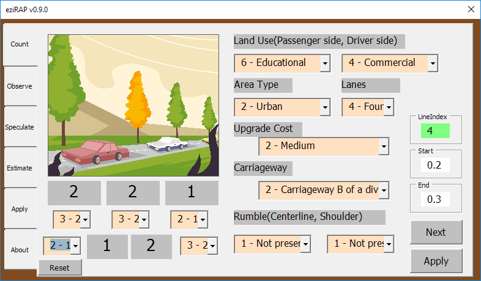
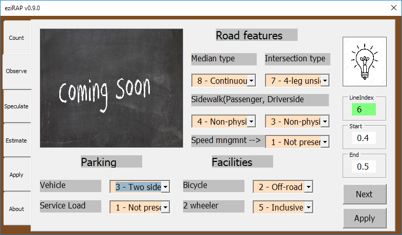
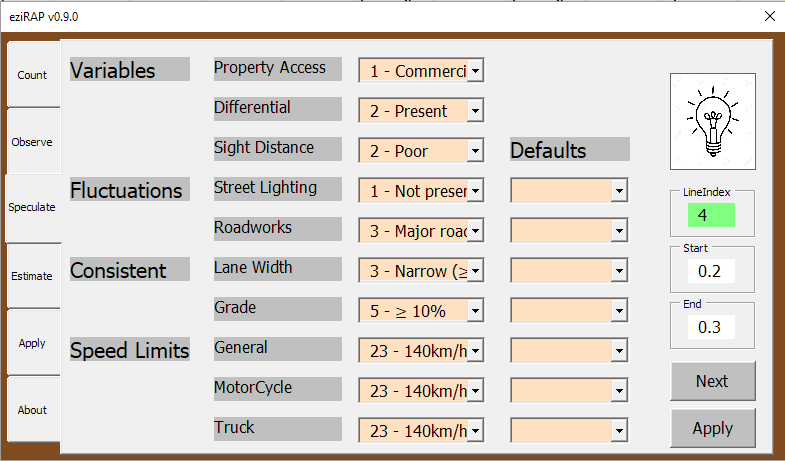
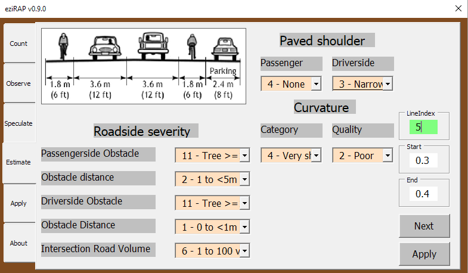
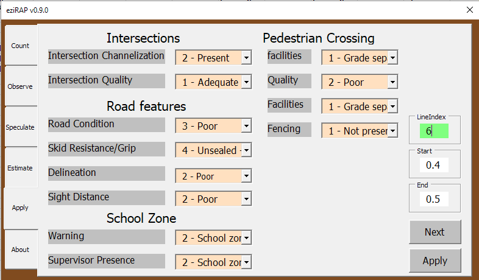

### My Contribution

I created an Excel GUI for iRAP analysts (in my institute and sister institutes) to easily record observations from video. This was my first B.Tech project, completed over a period of three academic months.

### About

The **The International Road Assessment Programme (iRAP)** is a charity organization that focuses on road safety.

Videos taken from car-mounted cameras are taken across the globe and thousands of analysts process these videos and generate insights about

- Traffic Volume (various vehicle sizes)
- Road quality (to visualize on google map)
- Safety Rating (star rating is provided to roads)

I observed a lot of manual duplicated tasks and suggested to help in automating the bulk of it and making the rest accessible.

### Problem Staement

1) If observations are recorded at 100m intervals, then it is very unlikely for certain road metrics like to change all of a sudden. e.g. -

- lighting
- passenger-side obstacles distance
- presence of medians

2) Similar obsrvations should also be collectivized, instead of being spready across hundreds of Excel columns.

3) Additionally, dropdowns are more reliable to review that copy pasted text, which may fail the iRAP pre-processor check due to typos.

### Gallery Showcase

#### Counting Page

First page allows recording observations for the following:

- Land Use
- Vehicle/Passenger Volumes

The gray items are counters, which increment on click. After completion of  a section, the user may insert the counter values in their designated dropdowns selected right below the counters.

i.e (for the previous 100m road section) -

- 2 pedestrians walking on the left
- 2 pedestrians crossing the road
- 1 pedestrian on the right
- 1 2-wheeler on the left side of road
- 2 * 2-wheelers on the right side of road

#### Observation Page

Second page allows recording about visible road conditions and presnce of supplementary facilities.

#### Speculation Page

Third page helps record miscellaneous surrounding features and speed limits.

**! I allow setting default limits, because I believe these parameters usually stay consistent throughtout the road (bar exceptions like hospital and school areas).**

### Estimation Page

Helps record size estimations and various safety lengths. An image reference with indian vehicle sizes has been attached for help with visual estimation.

### Miscellanous Page

Helps record anything not already cvered in previous pages

